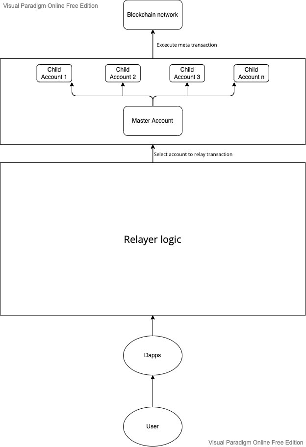

## Merel

A Meta transaction Relayer

## Introduction

Realizing the great potential that meta transactions bring, it makes it easier for end users to use as well as a plus
point to encourage users to use a platform that supports meta transactions. Because of that great potential, I
researched and created Merel. Merel (Meta transaction Relayer) is based on the structure of biconomy relayer, so it has
similar features with biconomy relayer and some improvements to make it easier for users.

## Problem when using biconomy relayer

When integrating using biconomy, I encountered some problems as follows:

1. The main network support of biconomy is Ethereum, while currently EVM-compatible blockchains spawn a lot and have a
   large number of users available and have more breakthroughs than Ethereum. As a developer I want the transaction meta
   to be as widespread, supporting as many networks as possible.
2. As far as I understand your Gas tank function can only deposit money without withdrawing money. This affects biconomy
   users significantly, they have to actively calculate the usage amount for dapps they use in the biconomy dashboard
   and top up it. Biconomy users cannot actively manage how much they want to spend on dapps they sign up for.
3. With a dapps with many users, handling multiple transactions at the same time is a concern. Allowing users to not
   have to wait too long for transactions as well as error messages about the relayer being overloaded is a pretty
   important thing, it has a big impact on the end user experience.
4. Relayer has to handle too many discrete transactions. For example, a biconomy user registers a dapp in biconomy,
   using a smartcontract that allows the smartcontract to interact with the token in the user's wallet, when the end
   user wants to perform a meta transaction, the relayer has to do up to 3 transactions.
    1. The first Permit transaction allows the target smart contract to use the token in the user's wallet.
    2. The second Permit transaction allows the smart contract fee manager to use the token in the user's wallet to
       transfer to feeRecevier.
    3. Execute transaction in the target contract, fulfill the needs of the user.
5. Fee manager for biconomy users, allowing to manage fee recipients and fee multiplier.
6. Allow biconomy users to create ERC20-permit, they can easily use the token they just created to use for dapps using
   the feature that allows to pay gas fees with the newly created token.

## Features of Merel

To solve the above problems, I have designed the following solutions.

1. Expand EVM compatible blockchains. The forward feature - allowing users to pay gas fees with ERC20 will fully support
   EVM compatible blockchains.
2. Allows biconomy users to easily manage the gas tank of each dapps.
3. Support processing many transactions at the same time, easily handle a large number of transactions.
4. The batch meta-transaction feature helps to combine multiple meta transactions into one processing transaction.
5. Fee management for biconomy users, allowing users to adjust the fee multiplier and the fee recipient.
6. The feature that allows biconomy users to generate ERC20-permit and attach that token to the dapps they create.

## System overview



**System components**:

1. **Users**: That stores the information of the users.
2. **Dapps**: That stores the information of the dapps like name, network.
3. **Purses**: That stores the infomation of the purse including:
    1. The master account that hold currency to funding for child accounts.
    2. The child accounts that execute meta transaction.
    3. Storage pending transaction for handle and tracking.
    4. Configuration that stores the configuration of the dapps.
4. **Smart contracts**: That stores the information of the smart contracts including:
    1. The smart contract name.
    2. The smart contract address.
    3. The smart contract ABI.
    4. The smart contract type.
    5. The meta transaction type.
5. **Meta api**: That stores the information of the meta api including:
    1. The meta api name.
    2. The meta api type.
    3. The method name.
    4. The method type.
6. Cron job: That runs the cron job to
    1. Checking tx count for account.
    2. Checking and auto fund for child accounts.

## Installation and running the system

```bash
$ docker-compose up
```

## Simple usage

I took the interactive front end sample from
biconomy's [erc20-forwarder-demo](https://github.com/bcnmy/erc20-forwarder-demo) repo and customize it to run compatible
with merel

Repo:
[Customize erc20 forwarder demo front end](https://github.com/huuhoa143/erc20-forwarder-demo)

**Merel has been integrated and used by me for the [Fizen Wallet](https://fizen.io) application. The results are
amazing**

## Future development and enhancements

- Complete some of the features mentioned above
- Features whitelist users, whitelist ip
- Feature to send email to admin when master account hits threshold
- Features clean child account and withdrawal all balance to master wallet
- Auto-scale children when all accounts hit the max pending setting?

## Stay in touch

- Author - [Bingxu](https://github.com/huuhoa143)
- Twitter - [@bingxu143](https://twitter.com/bingxu143)
- Linkedin - [https://www.linkedin.com/in/huuhoa143](https://www.linkedin.com/in/huuhoa143)

## Feedback

I'm looking forward to your feedback! Please share it [Merel Pull](https://github.com/huuhoa143/merel/pulls) or contact
me. Thanks!
